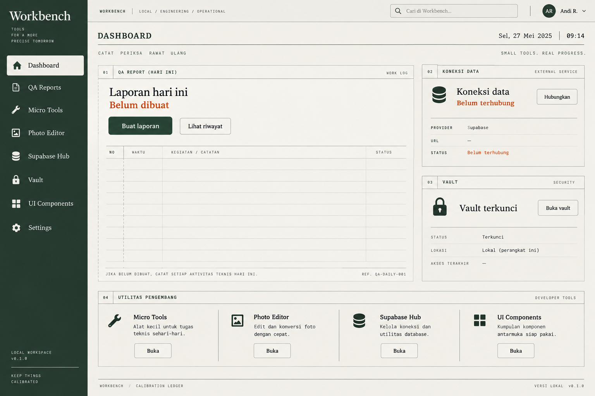

# DESIGN.md

## Workbench

Dokumen ini adalah source of truth untuk visual, UX, dan struktur komponen frontend. Semua halaman dan modul baru harus mengikuti keputusan di sini sebelum menambahkan pola visual baru.



## Design read

Ini adalah workspace teknis lokal untuk penggunaan harian. Produk harus terasa seperti buku kerja yang terkalibrasi: tenang, padat, tajam, dan dapat dipercaya. Ia bukan landing page marketing, kumpulan kartu SaaS, terminal cosplay, atau dashboard AI generik.

## Design dials

- `DESIGN_VARIANCE: 6/10` - grid ledger yang disiplin dengan komposisi panel yang tidak seragam.
- `MOTION_INTENSITY: 3/10` - motion hanya untuk feedback dan perpindahan state.
- `VISUAL_DENSITY: 7/10` - informasi cukup padat untuk workflow QA, tanpa membuat layar terasa seperti cockpit.

Keputusan ini menjaga Workbench cepat dipakai setiap hari. Keunikan datang dari struktur ledger, margin register, aturan tipis, tipografi, dan ritme layout; bukan dekorasi yang mengganggu pekerjaan.

## Visual direction

Nama internal: **Calibration Ledger**.

Karakter visual:

- Light-first seperti kertas kerja tulang dengan dukungan dark mode penuh untuk penggunaan malam.
- Sidebar hijau gelap berfungsi sebagai indeks tetap; kanvas kerja memakai surface hangat dan garis register.
- Hijau hutan adalah warna tindakan, graphite untuk struktur, dan oranye karat hanya untuk perhatian penting.
- Border tipis, field rows, dan grouping yang jelas lebih utama daripada shadow atau kartu dekoratif.
- Layout berbasis CSS Grid dengan satu area kerja dominan dan area pendukung yang lebih kecil.
- Tidak ada gradient sebagai latar utama, glassmorphism, glow, noise overlay, atau dekorasi yang tidak membawa informasi.
- Arah Miura menyumbang disiplin struktur yang tetap utuh saat responsif; HyperCard menyumbang state aktif yang tegas. Keduanya tidak disalin secara literal.
- Satu halaman tidak boleh terasa seperti berpindah produk saat masuk ke section lain.

## Color system

### Source palette

Palette menggantikan palet ungu lama dan bersumber dari dunia ledger teknis.

| Token            | Hex       | Peran                                  |
| ---------------- | --------- | -------------------------------------- |
| `--color-ink`    | `#17382D` | Sidebar, brand anchor, strong headings |
| `--color-violet` | `#60766B` | Secondary emphasis and supporting data |
| `--color-mauve`  | `#B54A25` | Rust accent for attention and focus    |
| `--color-blush`  | `#E8DFCC` | Warm highlight surface                 |

### Semantic tokens

Komponen tidak boleh memakai raw hex secara langsung. Semua warna harus melalui token semantic agar light dan dark mode dapat dirawat dari satu tempat.

Implementasi lengkap dan autoritatif berada di `frontend/src/shared/styles/tokens.css`. Token tambahan `--color-sidebar-*` dan `--color-ledger-line` menjaga shell, tabel, dan panel tetap satu dunia pada light/dark mode.

Rules:

- `--color-ink` adalah brand anchor dan base sidebar, bukan warna untuk setiap surface.
- `--color-mauve` sekarang berperan sebagai aksen karat. Pakai sedikit untuk focus dan perhatian, bukan dekorasi.
- `--color-blush` adalah warm highlight, bukan body background untuk setiap panel.
- Success, warning, danger, and info are semantic exceptions. They may appear in status badges and messages, but never as decorative accents.
- Color must never be the only way to communicate state. Add text, icon, or accessible label.
- Primary button text must pass WCAG AA against its background. Use dark text on pale accent surfaces and white text only on sufficiently dark surfaces.
- Use `--color-on-primary` for primary button text and `--color-on-danger` for danger button text. `--color-text-on-ink` is only for fixed dark brand surfaces, not for pale dark-mode buttons.
- Warning dan danger tetap merupakan warna semantik, bukan turunan dekoratif dari aksen karat.
- No pure black or pure white as page extremes. Use the tokens above to preserve hierarchy.

### Workspace palette customization

- Settings → Identitas workspace owns palette presets, four seed colors (Utama/ink, Sekunder/violet, Aksen/mauve, Highlight/blush), native color pickers, HEX entry, a collapsed import panel, and a browser-local saved-palette library. The saved-palette list has a clear Tambah palet action; add/edit opens one focused form for Name, Primary, Secondary, Accent, and Highlight. Choosing/editing only changes the preview; Terapkan palet commits to browser-local preferences. Saved palettes can be previewed and deleted without changing the active palette until the user applies one. Cancel restores the active palette.
- `shared/palettes.ts` normalizes HEX values and maps seed colors to semantic CSS tokens. Extra presets combine Material 2014 swatches; they are not complete Material themes. Surface/text/brand roles adapt together in light/dark modes. Contrast checks cover small text, primary buttons (including hover), highlights, and the sidebar mark. Status success/warning/danger/info remain unchanged.
- Arbitrary HTML/CSS/themes are never imported. Accept exactly four HEX colors or recognized Color Hunt/Coolors palette URLs containing four colors; parse locally, sort dark-to-light, allow role editing, and never fetch the supplied URL.
- Original is the unchanged CSS baseline. `[data-palette='original']` scopes that baseline to the preview even when another palette is active; resetting removes root token overrides. The active palette persists in `qa-portal:color-palette`; named palettes use `qa-portal:saved-color-palettes`, separately from the light/dark/system preference. No DB changes.
- Use shared cards/buttons/inputs and existing spacing. Preset selection has text plus aria-pressed, invalid HEX opens and focuses the relevant field, and controls stack on small screens. Do not apply raw seed colors directly to body text or buttons.

## Typography

Preferred pairing:

- UI and body: `Fira Sans`, fallback `ui-sans-serif, system-ui, sans-serif`.
- Code, data, keyboard shortcuts, IDs, and technical values: `Fira Code`, fallback `ui-monospace, SFMono-Regular, Consolas, monospace`.

Font files should be self-hosted when added. Do not load fonts from a third-party CDN at runtime because this is a local-first application.

Type rules:

- Base body size is `16px` with line-height between `1.45` and `1.6`.
- UI labels must not be smaller than `12px`; uppercase monospace chrome may use `11px` only when it is secondary and high-contrast.
- Light-mode supporting text must remain clearly legible against the warm page and surface colors; use the semantic muted token instead of opacity.
- Page titles use strong weight and controlled scale. Avoid oversized headlines that waste the working area.
- Use monospace only when the content is actually technical. Do not render the whole interface in monospace.
- Do not use italic or mixed font families as decoration.
- Labels sit above inputs. Placeholder text is never the only label.

Suggested scale:

| Role          |    Size |  Weight |
| ------------- | ------: | ------: |
| Page title    | 28-32px | 650-700 |
| Section title | 20-24px |     650 |
| Card title    | 16-18px |     600 |
| Body          | 14-16px | 400-500 |
| Metadata      | 12-13px | 450-500 |
| Code/data     | 12-14px | 400-500 |

## Shape, border, and elevation

Use one documented shape language:

- Inputs and buttons: `6px` radius.
- Cards and panels: `12px` radius.
- Status badges memakai bentuk label register bersudut ringan, bukan pill dekoratif.
- Modal dialogs: `12px` radius.
- Do not mix sharp cards, highly rounded buttons, and random pill containers without a functional reason.

Elevation is restrained:

- Default separation: whitespace, border, or background tint.
- Use a soft tinted shadow only for modal, popover, command palette, and floating navigation.
- Never use a large pure-black shadow on a light surface.
- Do not place cards inside cards unless the inner surface represents a distinct interactive region.

## App shell and layout

```text
┌─────────────────────────────────────────────────────────────┐
│ Top bar: product mark, active Supabase context, command key │
├────────────────┬────────────────────────────────────────────┤
│ Sidebar        │ Main content                                │
│                │ page header                                 │
│ Dashboard      │ working surface                             │
│ QA Reports     │ tables, forms, reports, or tool workspace   │
│ Micro Tools    │                                             │
│ Supabase Hub   │                                             │
│ Vault          │                                             │
│ Settings       │                                             │
└────────────────┴────────────────────────────────────────────┘
```

Layout rules:

- Desktop sidebar target width: `232px` to `256px`.
- Desktop sidebar is fixed to the viewport, reserving its width in the shell grid. Its navigation area scrolls independently on short viewports while brand/footer remain reachable. Collapsing changes both sidebar and grid width; mobile still uses the drawer.
- Top bar target height: `64px` to `72px`.
- Main content uses a centered container with `24px` to `40px` page padding.
- Use CSS Grid for dashboards and split layouts. Avoid percentage-based flex math.
- Content tables may use the available width, but must provide a deliberate mobile treatment.
- At `< 768px`, sidebar becomes a drawer, top bar remains usable, and all multi-column layouts collapse to one column.
- At `< 480px`, reduce page padding to `16px`, keep buttons and fields full width where needed, and never create horizontal page scroll.
- Do not use `h-screen` for layout-critical sections. Use `min-height: 100dvh` when a viewport-sized region is necessary.

## Reusable component architecture

Reusable UI must be implemented as separate Vue components. Do not duplicate button, card, input, modal, or table styling inside module views.

Recommended structure:

```text
frontend/src/
├── shared/
│   ├── components/
│   │   ├── layout/
│   │   │   ├── AppShell.vue
│   │   │   ├── AppSidebar.vue
│   │   │   ├── AppTopbar.vue
│   │   │   └── CommandPalette.vue
│   │   └── ui/
│   │       ├── UiButton.vue
│   │       ├── UiCard.vue
│   │       ├── UiBadge.vue
│   │       ├── UiInput.vue
│   │       ├── UiSelect.vue
│   │       ├── UiTextarea.vue
│   │       ├── UiCheckbox.vue
│   │       ├── UiTabs.vue
│   │       ├── UiModal.vue
│   │       ├── UiConfirmDialog.vue
│   │       ├── UiDataTable.vue
│   │       ├── UiCodeBlock.vue
│   │       ├── UiCopyButton.vue
│   │       ├── UiSkeleton.vue
│   │       ├── UiEmptyState.vue
│   │       ├── UiErrorState.vue
│   │       └── UiToast.vue
│   ├── composables/
│   └── styles/
│       ├── tokens.css
│       ├── globals.css
│       └── utilities.css
└── modules/
    ├── qa-reports/
    ├── micro-utilities/
    ├── supabase-hub/
    └── vault/
```

### Required component contracts

#### `UiButton.vue`

The only component allowed to own the shared button visual language.

- Props: `variant`, `size`, `type`, `disabled`, `loading`, and optional icon slots.
- Variants: `primary`, `secondary`, `ghost`, `danger`, `quiet`.
- Emits native `click` behavior and exposes disabled state correctly.
- Loading state keeps button width stable and prevents duplicate submission.
- Text must remain on one line on desktop.
- Icon-only mode is allowed only with a required accessible label.
- Every interactive state must include hover, focus-visible, active, disabled, and loading behavior.

#### `UiCard.vue`

The only component allowed to own shared panel and card treatment.

- Props: `tone`, `padding`, `interactive`, and optional semantic `as` element.
- Slots: `header`, default content, and `footer`.
- Supports `default`, `subtle`, and `outlined` tones using semantic tokens.
- Does not automatically add a shadow. Elevation must be an explicit variant.
- A card should represent a real group of related information. Do not use it as a wrapper around every paragraph or table row.
- Nested cards require a short comment explaining the separate hierarchy.

#### Other primitives

- `UiInput.vue`, `UiSelect.vue`, and `UiTextarea.vue` own labels, helper text, error text, focus state, and disabled state.
- `UiBadge.vue` is for semantic status or filter context, not decoration.
- `UiBreadcrumbs.vue` owns semantic breadcrumb navigation (`nav`, `ol`, `aria-current="page"`). Ancestors link back; the current label is text and long titles wrap.
- `UiModal.vue` owns focus trapping, Escape behavior, backdrop, and scroll locking.
- `UiConfirmDialog.vue` must be used for hard deletes and destructive actions.
- `UiDataTable.vue` owns loading, empty, error, sorting, pagination, and keyboard behavior for tables.
- `UiSkeleton.vue` must match the shape of the content it replaces. Avoid generic spinner-only loading states.
- `UiCopyButton.vue` must expose success and failure feedback and never leak sensitive values into labels or logs.
- `UiCodeBlock.vue` is for readable code or JSON output, not for fake product screenshots.

### Composition rules

- Module components compose shared primitives. They do not fork them.
- A module-specific component belongs under its module folder when it has domain meaning, such as `ReportItemEditor.vue` or `SecretRow.vue`.
- If the same visual pattern appears in two modules, extract it to `shared/components/ui/` before the second implementation diverges.
- Shared components use `<script setup lang="ts">`, strict typed props, typed emits, and no `any`.
- All API calls remain in the module's typed `api.ts`. Components should not contain inline `fetch()` calls.
- Styles use tokens and component classes. Raw hex values inside feature components are not allowed.

## Module-specific UI direction

### Dashboard

The dashboard is a launch surface, not an analytics wall.

- Show today's report state, active Supabase connection, Vault lock state, and links to the four micro-tools.
- Use a mixed layout with one primary working area and smaller supporting regions.
- Avoid four identical statistic cards in a row.

### QA Reports

- Prioritize the report editor and readable generated output.
- The default QA Reports page is a table, ordered by report date ascending (newest at the bottom). Put Tambah laporan above it; filter and backup controls use collapsed disclosure sections. Add/edit happens on a separate page with three sequential stages: activities (including metadata/environment/result), coverage, then issues/status.
- Show only fields for the current stage, with a numbered progress indicator and a back action that retains input. Move focus to the stage heading after advancing/back. Reuse `ActivityEditor` with stage-specific fields; keep data in the parent so folding, stage changes, and reordering cannot lose associations.
- Stages 1–2 use Lanjut and explicitly state that data is not yet saved. Stage 3 uses Simpan laporan and secondary Simpan & ekspor Slack .md. After a successful save, show the saved report rather than a competing preview beside the unfinished form. Offer a labeled select for Slack mrkdwn, Markdown, or plain text; copy/download match the selection. Do not add a finalization or delivery prerequisite.
- Use Laporan / report title breadcrumbs on detail/new pages. Back/new-date actions use bordered secondary buttons, and deletion uses a visible danger button, never hover-only affordance. Saved editable reports display Tersimpan; the internal draft value is not exposed as an unsaved-state label.
- Metrics use charts only where the trend is easier to understand than a table.
- Empty reports explain the next action. Finalized reports clearly disable editing actions.

### Micro Utilities

- Each tool gets a focused workspace with input and output zones.
- JSON and JWT content uses `UiCodeBlock.vue` or a real editor component when needed.
- The HTTP Client must make request state, response state, timeout, and network errors explicit.
- Do not make every tool look like a generic card grid. The tool workspace is the primary surface.
- Use `ToolLayout.vue` for breadcrumbs, tool navigation, and the responsive input/output workspace. Reuse the existing `UiButton`, fields, code block, copy button, badge, modal, and confirm dialog; key/value rows share `PairEditor.vue`.
- HTTP method + URL are the first action. Advanced headers/auth/body/variables are native disclosure sections, not another nested card stack. Show status with text and semantic color; disable duplicate sends and preserve the request after errors.
- History lists do not reveal URL, headers, body, or token. Loading a request is separate from sending it; destructive history/preset deletion always uses a visible danger button and confirmation.
- HTTP collections use sortable tables for collections and their saved requests. The list exposes only names, methods, counts, and timestamps; URL, headers, body, and credentials remain hidden until a request is explicitly loaded.
- Collection create/edit and request save use focused dialogs. Import adds a new collection without overwriting existing data. Export clearly warns that the downloaded JSON contains decrypted request details and must be treated as sensitive.
- JSON tree rows are virtualized and keyboard-focusable; match highlighting uses escaped text. Large output previews state their truncation while copy/download retains the full bounded result.
- All processing tools state their local-only behavior and limits. JWT time status must never say merely “valid”; signature verification is a separate explicit action with an expected algorithm and supplied key.

### Supabase Hub

- The active connection must be visible without opening a menu.
- Connection status uses text plus a semantic badge. A colored dot alone is insufficient.
- Service role capability and read-only mode must be clear before a query is sent.
- Destructive query controls are hidden or gated by explicit confirmation according to the PRD.

### Vault

- Locked state is the default and must not preload secret values.
- Unlock, lock, reveal, copy, timeout, and failure states must be visually distinct.
- Secret values stay masked in lists. Copy must not require reveal.
- Command and note values use a multiline monospace editor, while following the same masked-list and encrypted-storage rules as secrets.
- Destructive delete uses `UiConfirmDialog.vue` with irreversible wording.
- Avoid playful password-manager styling. This is a security-sensitive workspace.

## UX states and feedback

### QA Reports implementation patterns

- History uses server pagination with `UiDataTable` in `paginate=false` mode; do not paginate a server page a second time.
- Activity editing is a flat sequence of fieldsets using `ActivityEditor`, shared form controls, and one sticky save bar. Avoid a separate card around every input group.
- Each activity has an accessible toggle with `aria-expanded` and `aria-controls`, a compact ticket/environment/result summary, and persistent input state when folded. Open invalid required fields before showing validation. Adding an activity folds the others; changing stage opens activities so the next fields are apparent. Expand/collapse and stage navigation do not mark data dirty.
- Deletion reuses `DeleteReportButton` and `UiConfirmDialog` across list/editor. State exact report identity and irreversible child deletion, then check the report version server-side. Backup restore uses a separate non-destructive confirmation: existing dates are skipped, never overwritten.
- Monthly totals share one definition-list strip. The daily bar chart uses palette tokens and includes an expandable data table for exact values and assistive technology. An empty month displays an empty state, not a decorative chart.
- Daily preview uses escaped source text via `UiCodeBlock`, with long URLs wrapping within the output column. It shows the exact selected export source (Slack/Markdown/plain text), with one bullet per activity and indented continuation lines, not a claim of pixel-identical Slack rendering. Hide output during editing; keep download/preview failures separate from save errors. HTML is a download only.
- Reauthentication uses a non-dismissible shared modal over the mounted workspace so unsaved report input survives session expiration.

Every async surface must define these states before implementation:

- Initial state
- Loading state
- Empty state
- Success state
- Inline validation state
- Network or server error state
- Permission or locked state where applicable
- Disabled state

Rules:

- Prefer inline contextual errors near the affected control.
- Toasts are for transient confirmation only, not the only place an important error appears.
- Preserve user input when a request fails.
- Give destructive actions a confirmation step and a clear irreversible warning.
- Every async action shows progress without shifting the surrounding layout.
- Focus moves intentionally after modal open, submit error, and modal close.

## Motion and interaction

Motion intensity is `3/10`.

- Use `150ms` to `240ms` transitions for hover, focus, active, and open/close feedback.
- Animate only `opacity` and `transform` when possible.
- A button may scale to `0.98` on active to communicate press feedback.
- Loading uses skeleton transitions or a compact progress treatment matching the component.
- Do not use infinite decorative animations, parallax, cursor effects, scroll hijacking, or animated gradient backgrounds.
- Do not use `window.addEventListener('scroll')` for UI effects.
- Respect `prefers-reduced-motion: reduce` by reducing transitions to instant or removing non-essential motion.
- Every animation needs a reason: hierarchy, feedback, state transition, or spatial continuity.

## Accessibility baseline

- Body text contrast target is WCAG AA minimum, with stronger contrast for dense technical content.
- All controls must be keyboard reachable and show a visible `:focus-visible` ring.
- Minimum interactive target is `44px` on touch-sized controls. Compact desktop controls may be smaller only when the surrounding hit area remains accessible.
- Icon-only buttons require an accessible name and tooltip where the action is not obvious.
- Do not rely on hover for essential information.
- Use semantic headings in order and do not skip levels for visual sizing.
- Tables require accessible headers and a mobile strategy.
- Errors must be announced where appropriate and associated with their fields.
- Status badges include readable text, not color alone.

## Anti-AI-slop rules

These patterns are not allowed unless a future design decision explicitly documents a reason:

- Purple or blue neon glow, especially around every button.
- Gradient mesh backgrounds used as filler.
- Glassmorphism on every surface.
- Three identical feature cards as the default layout.
- A card inside a card inside another card without hierarchy.
- Generic hero copy, invented metrics, fake activity, or fake customer logos.
- Decorative status dots on every navigation item.
- Excessive pill buttons and rounded containers.
- Raw emojis as icons. Use one consistent SVG icon family if an icon library is added.
- Hand-drawn SVG icons or fake screenshots made from rectangles.
- Long lists rendered as endless bordered rows when tabs, filters, grouping, or a real table would be clearer.
- Hidden labels that exist only as placeholder text.
- Random accent colors that break the palette.
- Motion added only because a library is available.
- Copy that uses vague product language such as "seamless", "next-gen", "elevate", or "revolutionize" without a concrete meaning.

## Implementation checklist

Before a module is considered visually ready:

- [ ] It uses the shared color tokens and does not introduce a second palette.
- [ ] It uses `UiButton.vue`, `UiCard.vue`, and shared form primitives where applicable.
- [ ] It has loading, empty, error, disabled, and success states.
- [ ] It works with keyboard navigation and visible focus states.
- [ ] It has a deliberate mobile layout below `768px`.
- [ ] It has been checked in light and dark mode.
- [ ] Text and icon contrast pass the accessibility baseline.
- [ ] Destructive actions use `UiConfirmDialog.vue`.
- [ ] Sensitive values are masked and are not present in visible labels, errors, or logs.
- [ ] No duplicated primitive component or inline API request was added.
- [ ] Any new visual pattern is documented here before being reused elsewhere.

## Definition of done for shared components

A shared component is ready only when it has:

- A typed props and emits contract.
- All intended variants documented.
- Keyboard and focus behavior.
- Loading, disabled, error, and empty behavior when relevant.
- Light and dark token coverage.
- Responsive behavior.
- At least one unit or component test for behavior that is not purely visual.
- No raw secrets, network calls, or module-specific business logic.
